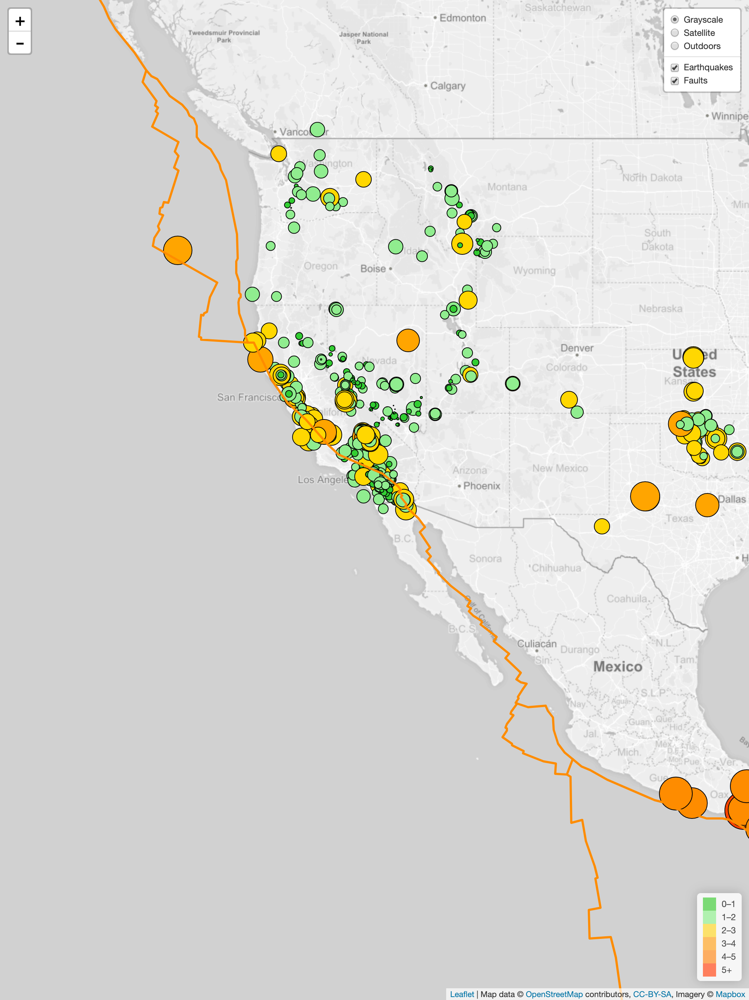

# Assignment 17: Visualizing Data with Leaflet
This exercises utilizes Leaflet.js to plot geographic locations of earthquake events detected during the last 7 days and boundaries of tectonic plates. Sources of the data used are as follows:
* [USGS Geo JSON Feed](https://earthquake.usgs.gov/earthquakes/feed/v1.0/geojson.php)
* [`fraxen/tectonicplates` Github repository](https://github.com/fraxen/tectonicplates/blob/master/GeoJSON/PB2002_boundaries.json)

For codes, please refer to the following documents:
* `static/js/logic.js` for main leaflet.js visualization
* `static/css/style.css`
* `index.html`

You can access the web dashboard by clicking [here](https://soobing91.github.io/leaflet-challenge/index.html).

The screenshot below captures the web app:

